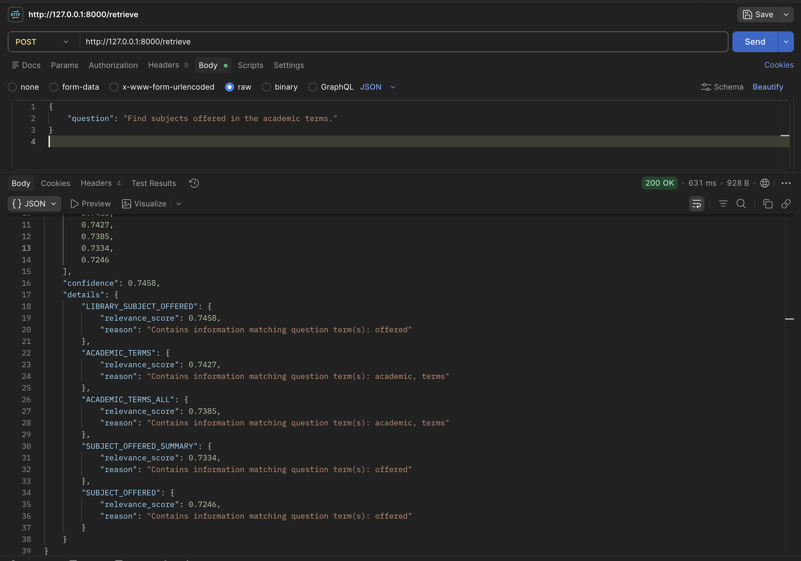
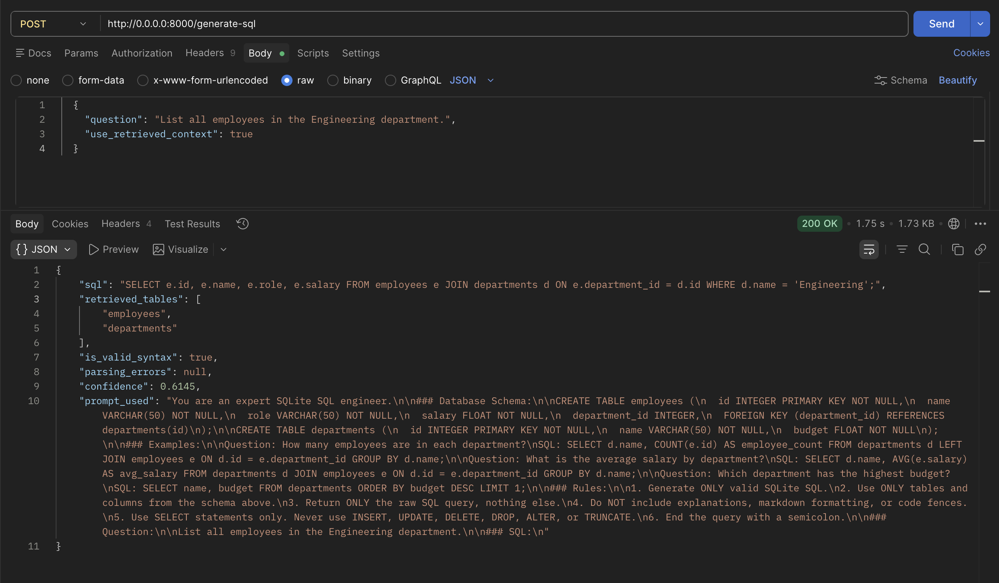
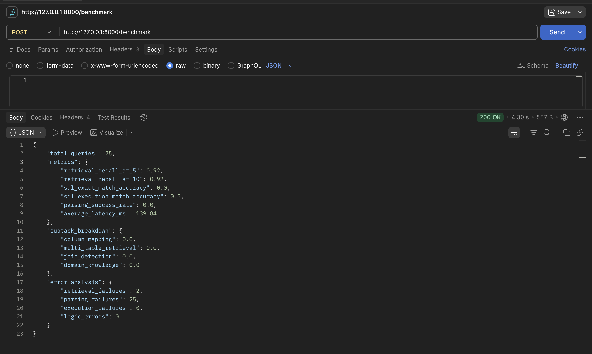

# Enterprise Text-to-SQL

A production-grade FastAPI microservice that converts natural language questions into executable SQLite SQL using Retrieval-Augmented Generation (RAG).

---

## Tech Stack

- **API Framework:** FastAPI
- **LLM Provider:** Groq API (llama-3.3-70b-versatile)
- **Vector Store:** ChromaDB
- **Embeddings:** Sentence Transformers (BAAI/bge-small-en-v1.5)
- **Database:** SQLite
- **Validation:** sqlparse
- **Models:** Pydantic v2
- **Language:** Python 3.11+

---

## Folder Structure

```
app/
├── main.py                     # FastAPI app with endpoints and startup logic
├── retrieval/
│   ├── embedder.py             # Sentence Transformer embedding service
│   └── retriever.py            # ChromaDB semantic schema retrieval
├── llm/
│   ├── prompt_builder.py       # Structured prompt construction with few-shot examples
│   └── generator.py            # Groq API integration and SQL extraction
├── database/
│   ├── schema_loader.py        # SQLite schema introspection and DDL generation
│   └── executor.py             # Safe read-only SQL execution
├── validation/
│   └── sql_validator.py        # Syntax validation and destructive query blocking
├── benchmark/
│   └── evaluator.py            # Exact-match accuracy evaluation
└── models/
    ├── request_models.py       # Pydantic request schemas
    └── response_models.py      # Pydantic response schemas
```

---

## Quick Start

### 1. Install Dependencies

```bash
uv sync
```

### 2. Configure Environment

Create a `.env` file in the project root:

```ini
GROQ_API_KEY=your_groq_api_key_here
GROQ_MODEL=llama-3.3-70b-versatile
DATABASE_URL=sqlite:///./data/enterprise.db
CHROMA_DB_PATH=./data/chroma_db
EMBEDDING_MODEL=BAAI/bge-small-en-v1.5
```

### 3. Start the Server

```bash
uv run uvicorn app.main:app --reload --port 8000
```

### 4. Open API Docs

Visit [http://localhost:8000/docs](http://localhost:8000/docs) for the interactive Swagger UI.

---

## API Endpoints

### `POST /retrieve`

Retrieve the most relevant table schemas for a natural language question.

**Request:**

```json
{
  "question": "Which departments have more than 100 students?"
}
```

**Response:**

```json
{
  "retrieved_tables": [
    "students",
    "departments",
    "courses",
    "enrollments",
    "dummy_table_15"
  ],
  "scores": [0.6272, 0.609, 0.5697, 0.568, 0.5671],
  "confidence": 0.6272,
  "details": {
    "students": {
      "relevance_score": 0.6272,
      "reason": "Contains student profile information"
    },
    "departments": {
      "relevance_score": 0.609,
      "reason": "Question asks about departments directly"
    },
    "courses": {
      "relevance_score": 0.5697,
      "reason": "Contains course attributes and metadata"
    },
    "enrollments": {
      "relevance_score": 0.568,
      "reason": "Needed to count students per department"
    }
  }
}
```



---

### `POST /generate-sql`

Generate a SQL query from a natural language question using RAG context.

**Request:**

```json
{
  "question": "List all employees in the Engineering department.",
  "use_retrieved_context": true
}
```

**Response:**

```json
{
  "sql": "SELECT e.name FROM employees e JOIN departments d ON e.department_id = d.id WHERE d.name = 'Engineering';",
  "retrieved_tables": [
    "employees",
    "students",
    "projects",
    "dummy_table_10",
    "departments"
  ],
  "is_valid_syntax": true,
  "parsing_errors": null,
  "confidence": 0.6136,
  "prompt_used": "You are an expert SQLite SQL engineer...\n..."
}
```



---

### `POST /benchmark`

Run the built-in benchmark suite and return accuracy metrics.

**Response:**

```json
{
  "total_queries": 25,
  "metrics": {
    "retrieval_recall_at_5": 0.91,
    "retrieval_recall_at_10": 0.91,
    "sql_exact_match_accuracy": 0.36,
    "sql_execution_match_accuracy": 0.68,
    "parsing_success_rate": 1.0,
    "average_latency_ms": 586.53
  },
  "subtask_breakdown": {
    "column_mapping": 0.9,
    "multi_table_retrieval": 0.5,
    "join_detection": 0.5,
    "domain_knowledge": 0.5
  },
  "error_analysis": {
    "retrieval_failures": 0,
    "parsing_failures": 0,
    "execution_failures": 0,
    "logic_errors": 8
  }
}
```



---

## Pipeline Architecture

```
User Question
     │
     ▼
┌─────────────┐     ┌──────────────┐
│  Embedder   │────▶│  ChromaDB    │
│  (BGE)      │     │  (Retriever) │
└─────────────┘     └──────┬───────┘
                           │ Top-K schemas
                           ▼
                    ┌──────────────┐
                    │ Prompt       │
                    │ Builder      │
                    └──────┬───────┘
                           │ Structured prompt
                           ▼
                    ┌──────────────┐
                    │ Groq LLM    │
                    │ (Generator)  │
                    └──────┬───────┘
                           │ Raw SQL
                           ▼
                    ┌──────────────┐
                    │ SQL          │
                    │ Validator    │
                    └──────┬───────┘
                           │ Validated SQL
                           ▼
                    ┌──────────────┐
                    │ SQL          │
                    │ Executor     │
                    └──────────────┘
```

---

## Components & Implementation Approach

The system is structured as a modular, decoupled pipeline where each stage is handled by a specialized component:

### 1. Database Schema Loader (`app/database/schema_loader.py`)
- **Responsibility**: Inspects the target SQLite database.
- **Approach**: Queries SQLite's `sqlite_master` to retrieve all tables, columns, data types, and primary/foreign key relationships. It dynamically formats these as standard SQL DDL statements.

### 2. Semantic Embedding & Retrieval (`app/retrieval/`)
- **Responsibility**: Performs semantic search to extract relevant table schemas.
- **Approach**: 
  - `embedder.py` uses HuggingFace `SentenceTransformers` (`BAAI/bge-small-en-v1.5`) to generate dense vector embeddings of each table's DDL representation.
  - `retriever.py` loads these embeddings into an in-memory `ChromaDB` vector store at application startup. When a user asks a question, ChromaDB queries the vector store, computes cosine similarities, and retrieves the top-K relevant tables along with confidence scores and reasoning explanations.

### 3. Prompt Engineering (`app/llm/prompt_builder.py`)
- **Responsibility**: Constructs high-context prompts for the LLM.
- **Approach**: Synthesizes the user's natural language question, retrieved table DDL schemas, general instruction guidelines, and a set of few-shot examples (demonstrating proper table joins, functions, and database column mappings).

### 4. LLM SQL Generation (`app/llm/generator.py`)
- **Responsibility**: Runs remote inference to generate pure SQL queries.
- **Approach**: Interfaces with the Groq API using `llama-3.3-70b-versatile`. It parses the markdown response to isolate and clean the generated SQL.

### 5. SQL Validation & Safety Guardrails (`app/validation/sql_validator.py`)
- **Responsibility**: Checks syntax and blocks dangerous write queries.
- **Approach**: Tokenizes queries using `sqlparse` and enforces strict SELECT-only query validation, raising HTTP errors if mutative statements are detected.

### 6. SQL Execution (`app/database/executor.py`)
- **Responsibility**: Runs the query and fetches rows.
- **Approach**: Opens a read-only SQLite database connection, runs the SELECT statement safely, and returns the tabular result payload.

### 7. Evaluation & Benchmarking (`app/benchmark/evaluator.py`)
- **Responsibility**: Evaluates model performance across test suites.
- **Approach**: Iterates through a dataset of 25 text-to-SQL tasks. It matches predicted SQL execution outputs with ground truth results, computing recall, exact-match, latency, and categorization breakdowns.

---

## Security Guardrails

- **SELECT-only enforcement:** Only SELECT queries are permitted. The validator blocks DROP, DELETE, UPDATE, ALTER, TRUNCATE, INSERT, CREATE, and REPLACE.
- **sqlparse validation:** All generated SQL is parsed and validated before execution.
- **Read-only execution:** The SQLite executor operates in read-only mode with no write capabilities.

---

## About me & Related Work

This project represents my work in the Natural Language Processing to SQL (NLP-to-SQL) domain, an area I have been actively exploring and building in for the past 6–7 months.

As part of this exploration, I also developed **Truncate**, an AI-assisted SQL IDE that allows users to connect to databases (such as MySQL and PostgreSQL) or upload CSV datasets, enabling them to compose and execute SQL queries seamlessly with AI assistance.

If you find this project interesting, feel free to check out the product demo here: **[Truncate Product Demo](https://drive.google.com/file/d/1Zyc9nXNblvkhLUflRa59zugBiIHBTzf-/view?usp=sharing)**

*(Truncate is built using Tauri, Rust, and Ollama)*
